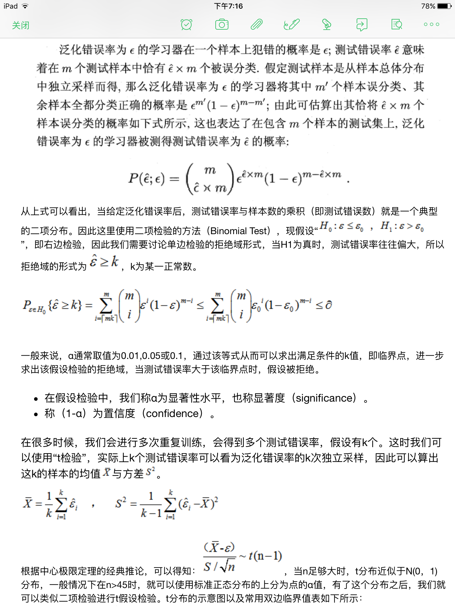
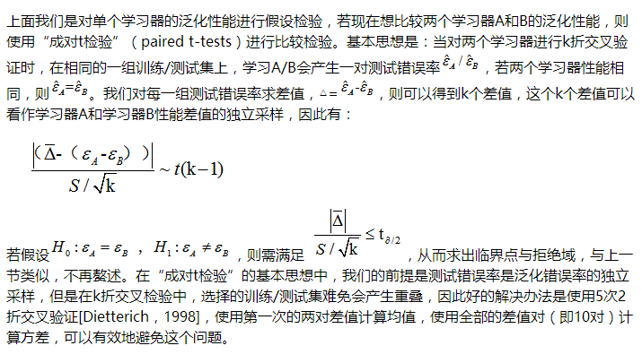
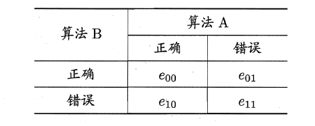
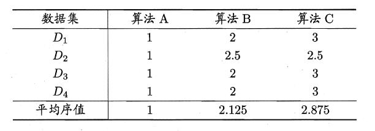

在上两篇中，我们介绍了多种常见的评估方法和性能度量标准，这样我们就可以根据数据集以及模型任务的特征，选择出最合适的评估和性能度量方法来计算出学习器的“测试误差“。但由于“测试误差”受到很多因素的影响，例如：算法随机性(例如常见的K-Means)或测试集本身的选择，使得同一模型每次得到的结果不尽相同，同时测试误差是作为泛化误差的近似，并不能代表学习器真实的泛化性能，那如何对单个或多个学习器在不同或相同测试集上的性能度量结果做比较呢？这就是比较检验。最后偏差与方差是解释学习器泛化性能的一种重要工具。本篇延续上一篇的内容，主要讨论了比较检验、方差与偏差。

##**2.6 比较检验**

在比较学习器泛化性能的过程中，统计假设检验（hypothesis test）为学习器性能比较提供了重要依据，即若A在某测试集上的性能优于B，那A学习器比B好的把握有多大。 为方便论述，本篇中都是以“错误率”作为性能度量的标准。

###**2.6.1 假设检验**

“假设”指的是对样本总体的分布或已知分布中某个参数值的一种猜想，例如：假设总体服从泊松分布，或假设正态总体的期望u=u0。回到本篇中，我们可以通过测试获得测试错误率，但直观上测试错误率和泛化错误率相差不会太远，因此可以通过测试错误率来推测泛化错误率的分布，这就是一种假设检验。

###**2.6.2 交叉验证t检验**

###**2.6.3 McNemar检验**

MaNemar主要用于二分类问题，与成对t检验一样也是用于比较两个学习器的性能大小。主要思想是：若两学习器的性能相同，则A预测正确B预测错误数应等于B预测错误A预测正确数，即e01=e10，且|e01-e10|服从N（1，e01+e10）分布。

因此，如下所示的变量服从自由度为1的卡方分布，即服从标准正态分布N（0,1）的随机变量的平方和，下式只有一个变量，故自由度为1，检验的方法同上：做出假设-->求出满足显著度的临界点-->给出拒绝域-->验证假设。

###**2.6.4 Friedman检验与Nemenyi后续检验**

上述的三种检验都只能在一组数据集上，F检验则可以在多组数据集进行多个学习器性能的比较，基本思想是在同一组数据集上，根据测试结果（例：测试错误率）对学习器的性能进行排序，赋予序值1,2,3...，相同则平分序值，如下图所示：

若学习器的性能相同，则它们的平均序值应该相同，且第i个算法的平均序值ri服从正态分布N（（k+1）/2，（k+1）(k-1)/12），则有：

服从自由度为k-1和(k-1)(N-1)的F分布。下面是F检验常用的临界值：

若“H0：所有算法的性能相同”这个假设被拒绝，则需要进行后续检验，来得到具体的算法之间的差异。常用的就是Nemenyi后续检验。Nemenyi检验计算出平均序值差别的临界值域，下表是常用的qa值，若两个算法的平均序值差超出了临界值域CD，则相应的置信度1-α拒绝“两个算法性能相同”的假设。

##**2.7 偏差与方差**

偏差-方差分解是解释学习器泛化性能的重要工具。在学习算法中，偏差指的是预测的期望值与真实值的偏差，方差则是每一次预测值与预测值得期望之间的差均方。实际上，偏差体现了学习器预测的准确度，而方差体现了学习器预测的稳定性。通过对泛化误差的进行分解，可以得到：

 + **期望泛化误差=方差+偏差**	
 + **偏差刻画学习器的拟合能力**
 + **方差体现学习器的稳定性**

易知：方差和偏差具有矛盾性，这就是常说的偏差-方差窘境（bias-variance dilamma），随着训练程度的提升，期望预测值与真实值之间的差异越来越小，即偏差越来越小，但是另一方面，随着训练程度加大，学习算法对数据集的波动越来越敏感，方差值越来越大。换句话说：在欠拟合时，偏差主导泛化误差，而训练到一定程度后，偏差越来越小，方差主导了泛化误差。因此训练也不要贪杯，适度辄止。

